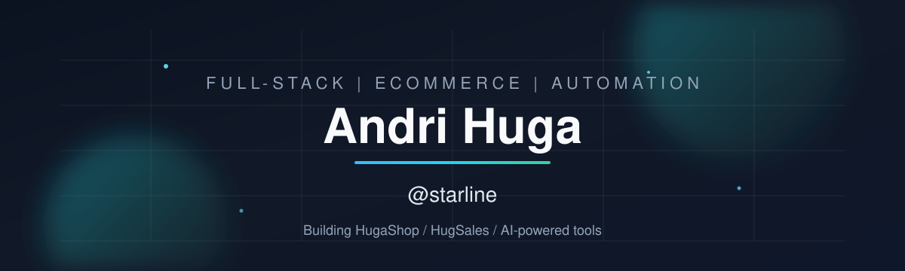

<!-- github.com/starline -->

  

<h1 align="center">Hi, I'm Andri Huga ??</h1>

  <b>Full-stack developer</b> ù ecommerce platforms ù Chrome extensions ù Telegram &amp; AI agents 
  Based in the US ù shipping products under <b>HugaShop</b> / <b>HugSales</b>

  
  
  

---

<h3 align="center">??? Languages &amp; Tools</h3>

  

  
  
  
  
  
  

---

<h3 align="center">?? GitHub Stats</h3>

  
  

  

---

<!-- Snake appears after the workflow runs once; until then the dark placeholder may 404 briefly -->

  <picture>
    <source media="(prefers-color-scheme: dark)" srcset="https://raw.githubusercontent.com/starline/starline/output/github-snake-dark.svg"/>
    <source media="(prefers-color-scheme: light)" srcset="https://raw.githubusercontent.com/starline/starline/output/github-snake.svg"/>
    
  </picture>

---

<h3 align="center">?? Featured Projects</h3>

<table>
  <tr>
    <td width="50%" valign="top">
      <h4><a href="https://github.com/starline/HugaShop">?? HugaShop</a></h4>
      
Ecommerce CMS ù product catalog, checkout, and storefront tooling.

      

        
        
      

    </td>
    <td width="50%" valign="top">
      <h4><a href="https://github.com/starline/HugaShopReact">?? HugaShopReact</a></h4>
      
Modern React/TypeScript front for the HugaShop ecosystem.

      

        
        
      

    </td>
  </tr>
  <tr>
    <td width="50%" valign="top">
      <h4><a href="https://github.com/starline/CursorTgBot">?? CursorTgBot</a></h4>
      
Telegram bot that drives a local Cursor agent ù remote coding via <code>/task</code>, diffs &amp; tests.

      

        
        
      

    </td>
    <td width="50%" valign="top">
      <h4><a href="https://github.com/starline/HugSalesSaaS">?? HugSales SaaS</a></h4>
      
Multi-tenant ecommerce SaaS stack around HugSales / HugaShop.

      

        
        
      

    </td>
  </tr>
  <tr>
    <td width="50%" valign="top">
      <h4><a href="https://github.com/starline/ChromeAutoScraperExtension">?? Chrome Extensions</a></h4>
      
Auto-scraper, photos &amp; proxy helpers for browser automation workflows.

      

        
        
      

    </td>
    <td width="50%" valign="top">
      <h4><a href="https://github.com/starline/TelegramPersonalBot">?? TelegramPersonalBot</a></h4>
      
Personal Telegram assistant built with TypeScript.

      

        
        
      

    </td>
  </tr>
</table>

---

<table>
<tr>
<td width="48%" valign="top">

### ? Focus Areas
- Ecommerce CMS & multi-account SaaS
- Browser extensions & scraping pipelines
- Telegram bots + AI/agent automation
- Dockerized PHP & Node deployments

</td>
<td width="48%" valign="top">

### ????? About Me
I'm a product-minded developer with years of shipping storefronts, CMS platforms, and automation tools. I like turning messy business workflows into clean systems ù from HugaShop stores to Cursor-powered agents.

Always building, always iterating.

</td>
</tr>
</table>

---

<h3 align="center">?? Connect</h3>

  
  

  <i>Open to collaboration on ecommerce, SaaS, and automation projects.</i>

